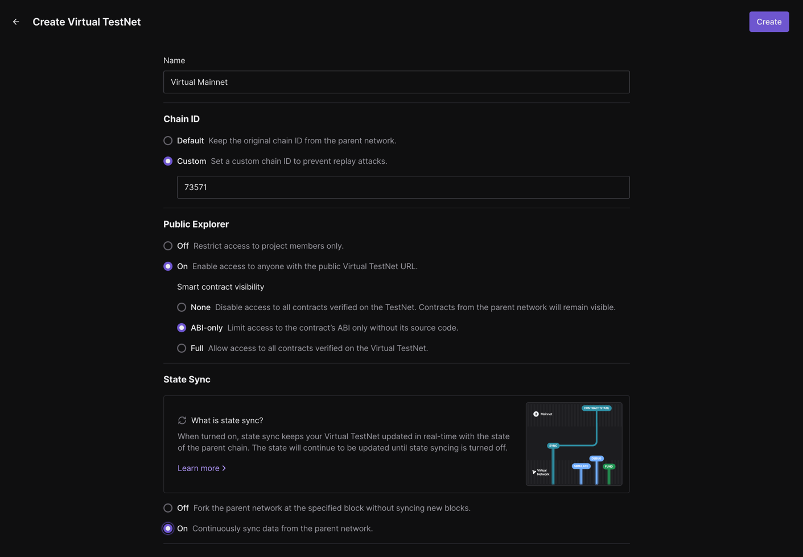
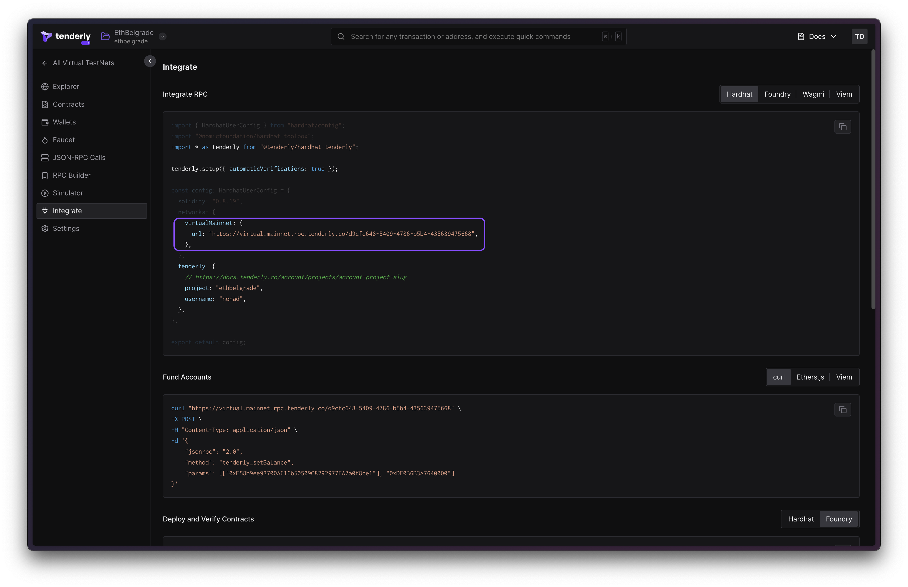
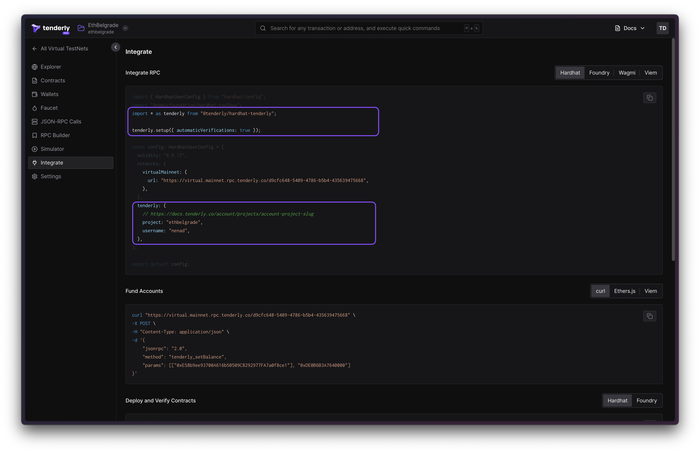

# Staging in Web3 Workshop

In this workshop, you will learn how to use Virtual TestNets. More specifically:

- How to use Unlimited faucet to gain arbitrary amounts of tokens and native balances
- How to deploy Hardhat contracts to a Virtual TestNet
- How to stage smart contracts
- How to stage dapp UI
- How to create a Github action that will stage your smart contracts

## Act 1: Warmup

1. **Create a TestNet**
   
2. Add the network to MetaMask
3. Copy the address from MetaMask and fund it by going to **Unlimited Faucet** in Dashboard

## Act 2: Preparation

1. **Configure Hardhat**
    - Copy the correct snippet from Tenderly Dashboard **Virtual TestNets > Integrate**
    - Edit `packages/tenderly/tenderly.config.ts` and paste the copied object to `virtualNetworks.virtual_mainnet`
      entry.
    - Run `cd packages/tenderly && npm stage:connect hardhat && npm stage:connect nextjs`.

This will create configuration files referencing the given Virtual TestNet from `packages/hardhat`
and `packages/nextjs`.



2. Deploy contracts

Run the following command

```bash
cd packages/hardhat
rm -r deployments/virtual_mainnet
npx hardhat deploy --network virtual_mainnet
```

The file `nextjs/tenderly.config.ts`, containing chain configuration.

3. Interact

Run your NextJs server.

```bash
cd packages/tenderly
npm run connect:nextjs
cd packages/nextjs
npm run start
```

- Pick the **Burner Wallet**
- Click 💵 Faucet button
- Reload the page (because the funds are already there)

## Intermezzo: Verification, of course

It's almost fully set up. Do the following:

- Install [Tenderly CLI](https://github.com/Tenderly/tenderly-cli?tab=readme-ov-file#installation), then
  run `tenderly login` and follow the instructions

## Full setup instructions (skip)

To set up verification, here are the steps:

- Install [Tenderly CLI](https://github.com/Tenderly/tenderly-cli?tab=readme-ov-file#installation), then
  run `tenderly login` and follow the instructions
- Run `cd packages/hardhat && yarn add @tenderly/hardhat-tenderly`
- From **Virtual TestNets > Integrate** page, copy the first (`import`
  and `tenderly.setup({ automaticVerifications: true })`) and the third
  snippet (`username, project`) and update `packages/hardhat/hardhat.config.ts` accordingly.

  

- Re-Deploy and do something to your contract (Act 2, steps 2-4)
- Open the latest transaction. What do you see?

For more details, see
the [verification docs](https://docs.tenderly.co/virtual-testnets/develop/deploy-contracts#deploy-contracts-using-hardhat).

## Act 3: The Stage

But how can you get a fresh TestNet on demand?

- Run `npm run stage:new local` to get a new Virtual TestNet you can use to set up a new staging environment
- Run `npm run stage:activate local` to make this environment active
- Run `npm run stage:connect nextjs && npm run stage:connect hardhat` to link next.js and hardhat with the active
  environment

After this, your Next.js and hardhat projects are configured to talk to the newly created testnet.

## Act 5: Build

This is nice, but how to do it in the cloud?

1. Create the file `.github/workflows/stage-dapp.yaml`
   your [Dapp Staging Github Action](https://docs.github.com/en/actions/quickstart)  (see the yaml below)
2. Configure your github action with the following **environment variables**:
3. Configure your github action with the following **secrets**:
   `TENDERLY_ACCOUNT_ID`
   and `TENDERLY_PROJECT_ID` ([guide](https://docs.tenderly.co/account/projects/account-project-slug))
   `TENDERLY_ACCESS_TOKEN` ([guide](https://docs.tenderly.co/account/projects/how-to-generate-api-access-token)).

```yaml filename='stage-dapp' showLineNumbers
name: Stage Dapp

env:
  TENDERLY_ACCOUNT_ID: ${{ secrets.TENDERLY_ACCOUNT_ID }}
  TENDERLY_PROJECT_ID: ${{ secrets.TENDERLY_PROJECT_ID }}
  TENDERLY_ACCESS_TOKEN: ${{ secrets.TENDERLY_ACCESS_TOKEN }}
on:
  pull_request:
    branches:
      - main
  push:
    branches:
      - tenderly/testnets-staging
jobs:
  ci:
    runs-on: ${{ matrix.os }}

    strategy:
      matrix:
        os: [ ubuntu-latest ]
        node: [ lts/* ]

    steps:
      - uses: actions/setup-node@v2
        with:
          node-version: ${{ matrix.node }}
      - uses: actions/cache@v2
        with:
          path: '**/node_modules'
          key: ${{ runner.os }}-modules-${{ hashFiles('**/yarn.lock') }}

      - name: Install Yarn
        run: npm install -g yarn

      - name: Install Tenderly CLI
        run: curl https://raw.githubusercontent.com/Tenderly/tenderly-cli/master/scripts/install-linux.sh | sudo sh

      - name: Authenticate Tenderly CLI
        run: tenderly login --access-key ${{ secrets.TENDERLY_ACCESS_TOKEN }} --authentication-method access-key

      - name: Install
        run: yarn install

      - name: Checkout
        uses: actions/checkout@master

      - name: Setup node env
        uses: actions/setup-node@v3
        with:
          node-version: ${{ matrix.node }}
          cache: yarn

      - name: Install dependencies
        run: yarn install --immutable

      # New chains
      - name: Create an environment
        run: |
          npm run stage:new now 1 34443 8453
          source .environment
          npm run stage:activate $ENVIRONMENT_NAME
        working-directory: packages/tenderly

      # Hardhat
      - name: Hardhat Deploy
        run: |
          source .environment
          npm run stage:connect:hardhat $ENVIRONMENT_NAME
          npx hardhat deploy --network virtual_mainnet
        working-directory: packages/tenderly

      # Next.js
      - name: Frontend Deploy
        run: |
          source .environment
          npm run stage:connect:nextjs $ENVIRONMENT_NAME
          echo "Insert vercel deploy here"
        working-directory: packages/tenderly

      # TheGraph
      - name: TheGraph Deploy
        run: |
          source .environment
          npm run stage:connect:thegraph $ENVIRONMENT_NAME
          echo "TODO: Build TheGraph files"
          echo "Build the Graph and deploy a node with custom RPC"
        working-directory: packages/tenderly
```